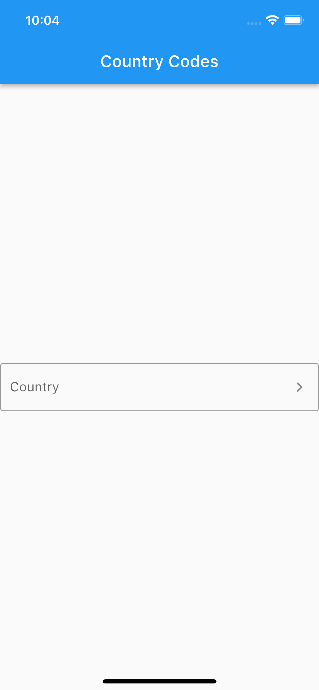
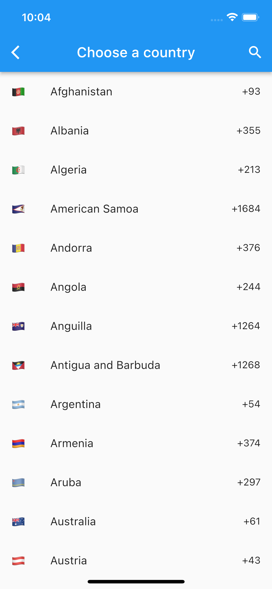
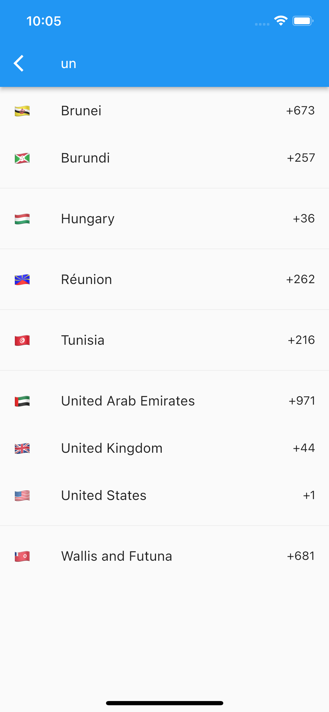

# Contry Codes 🌍

A list of all the country codes, dial codes, their corresponding country names, and flag.

## Features

You can use the following features:
1. Show the user a customizable Text Field to select Country Code. 🚀
2. Find the dial code of a specific country. 🔍

Extras
1. Have access to all the country codes.
2. Get the country code by country name.
3. Get the country name by country code.
4. Get the country by dial code.

## ⚙️ Getting started

Install the package by adding the following line into your `pubspec.yaml` file:

```yaml
dependencies:
  countrycodes: <VERSION>
```

Now import the package into your project:

```dart
import 'package:countrycodes/countrycodes.dart';
```

## 📚 Usage 

### 1. Country Field 🚀

To show the user a customizable Text Field to select Country Code, use the following code:

```dart
CountryField(
    onSelect: (Country c) {
        print('Selected country: $c');
    },
)
```

<div align="center">
  
  &nbsp;&nbsp;&nbsp;&nbsp;
  
  &nbsp;&nbsp;&nbsp;&nbsp;
  
</div>
<br>

### 2. Find Country 🔍

Second, to find the dial code of a specific country, use the following code:

```dart
var country = Countries.findByName("United Kingdom");

print(country.flag); // 🇬🇧
```

Similarly, you can get the country code, country name, and country flag by country name, country code, and dial code.

```dart
var c1 = Countries.findByName("United Kingdom");
var c2 = Countries.findByCode("GB");
var c3 = Countries.findByDialCode("44");

print(c1 == c2); // true
print(c1 == c3); // true
```

If the country is not found, an exception will be thrown.

## Model 🧑🏻‍💻

Country object is as shown below:

```dart
class Country {
  final String name;
  final String code;
  final String dialCode;
  final String flag;

  const Country({
    required this.name,
    required this.code,
    required this.dialCode,
    required this.flag,
  });
}
```


# Contribute 💻
If you'd like to have a feature added, please open an issue or create a pull request.


# License 🔑

License details can be found in the [LICENSE](./LICENSE) file.

